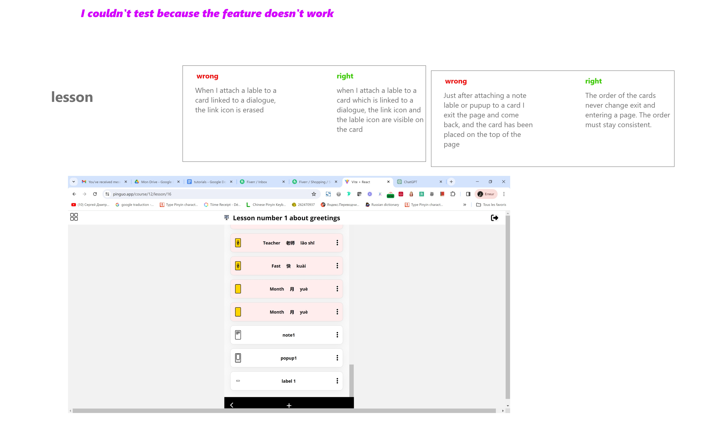
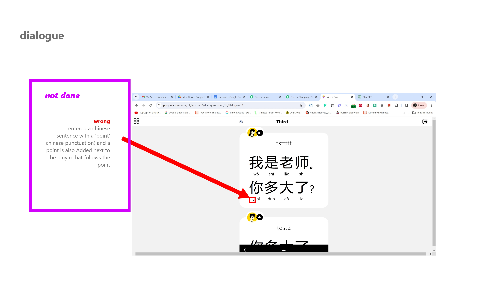

1. Main Word card vertical ellipson not clicking properly ::--Solved

2. Duplciate course popup Save button not clickable :: -- SOlved

# 3. (Not Answered) Add Previously Uploaded Image name in dialogue Image upload feature if there is one.

# 6. Explain why some cards have a complete word and some has half word and still make sense.

# 7. Remove all useless options from cards (Edit, Duplicate, etc) (based on page and usage)

# 8. Fiz CSS for Lesson Attachment Popup

# 9. 

# 12. 

## Total Issues: 9

## Remaining Issues: 7
